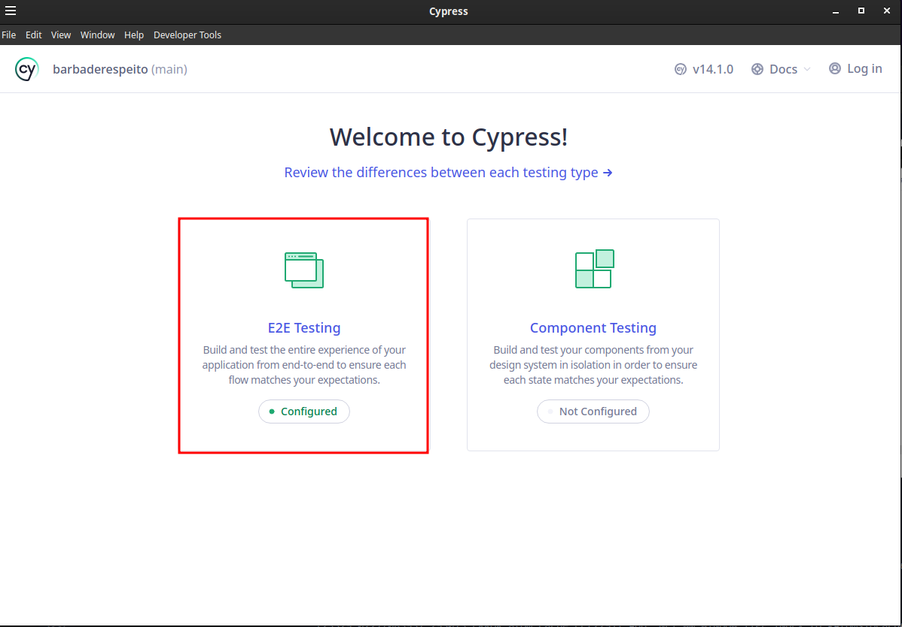
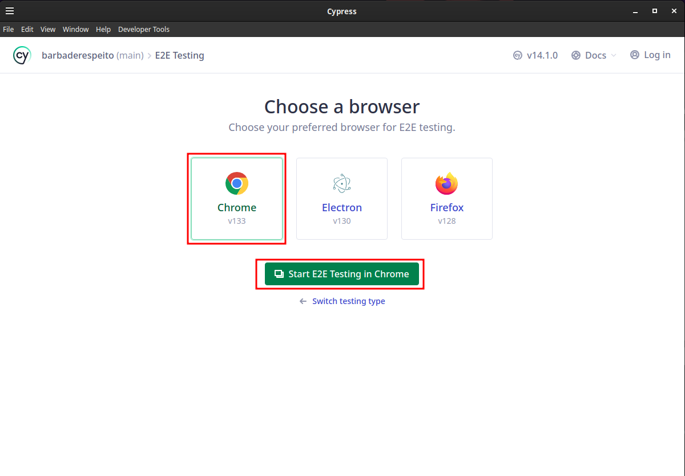

# Pré-requisitos

Antes de começar, garanta que os seguintes requisitos sejam atendidos:

- Computador 64 bits com no mínimo 2 cores
- e no mínimo 4 GB de memória RAM (Se tiver menos o projeto irá funcionar mas podem ocorrer erros inesperados)

Além disso, garanta que os seguintes sistemas estejam instalados em seu computador:

- [Cypress](https://www.cypress.io/)  
  - Versão utilizada: `14.1.0`

- Complementos necessários para o projeto:
  - **Faker**: Para instalar, execute o comando no terminal:
    ```sh
    npm install @faker-js/faker --save-dev
    ```
  - **Gerador de CPF**: Para instalar, utilize o seguinte comando:
    ```sh
    npm install gerador-validador-cpf --save-dev
    ```

- [Google-Chrome](https://www.google.com.br/chrome/index.html) (estou usando a versão `133.0.6943.141`enquanto escrevo este projeto)
- [git](https://git-scm.com/) (estou usando a versão `2.39.5` enquanto escrevo este projeto)
- [Node.js](https://nodejs.org/en/) (estou usando a versão `v22.14.0` enquanto escrevo este projeto)
- npm (estou usando a versão `11.1.0` enquanto escrevo este projeto)
- [Visual Studio Code](https://code.visualstudio.com/) (estou usando a versão `1.97.2` enquanto escrevo este projeto) ou alguma outra IDE de sua preferência

> **Obs.:** Recomendo utilizar as mesmas versões, ou versões mais recentes dos sistemas listados acima de sempre preferrencia para as versões LTS.
>
> **Obs. 2:** Ao instalar o Node.js o npm é instalado junto. 🎉
>
> **Obs. 3:** Para verificar as versões do git, Node.js e npm instaladas em seu computador, execute o comando `git --version && node --version && npm --version` no seu terminal de linha de comando.
>
> **Obs. 4:** Deixei links para os instaladores na lista de requisitos acima, caso não os tenha instalados ainda.

___

Legal, os pre-requisitos estão prontos. ☑️

1. Clone este projeto
2. Execute o comando `npx cypress open` para abrir o Cypress 
3. Na Suite do Cypress selecione *E2E Testings*


4. Apos Clicar em *E2E Testings* navegador desejado por padrão o Cypress necessita que o navegador esteja instalado em sua maquina para poder utilizar o mesmo (recomendo utilizar o google chrome)

5. após isso só escolher se quer executar os testes de *API* ou *E2E*.
